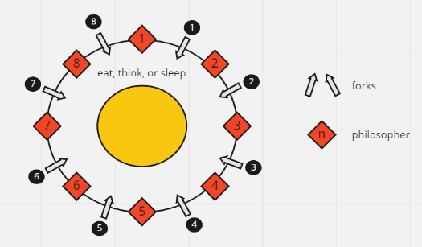
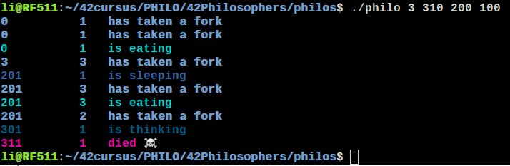

# 42Philosophers

In this project, a classic compute problem, i will treat the basics of threading a process. 
It's showed how to create threads and the basis of mutexes. </br></br>
Here are the things we need to know if we want to succeed this assignment:<br/><br/>
• One or more philosophers sit at a round table.
There is a large bowl of spaghetti in the middle of the table.<br/>
• The philosophers alternatively eat, think, or sleep.
While they are eating, they are not thinking nor sleeping;
while thinking, they are not eating nor sleeping;
and, of course, while sleeping, they are not eating nor thinking.<br/>
• There are also forks on the table. There are as many forks as philosophers.<br/>
• Because serving and eating spaghetti with only one fork is very inconvenient, a
philosopher takes their right and their left forks to eat, one in each hand.<br/>
• When a philosopher has finished eating, they put their forks back on the table and
start sleeping. Once awake, they start thinking again. The simulation stops when
a philosopher dies of starvation.<br/>
• Every philosopher needs to eat and should never starve.<br/>
• Philosophers don’t speak with each other.<br/>
• Philosophers don’t know if another philosopher is about to die.<br/>
• No need to say that philosophers should avoid dying!<br/>

#### Schema



## Use:

🚧 project:<br/>
```
42Philosophers/philos $ make
```
🚿 Clean Obj files:<br/>
```
42Philosophers/philos $ make clean
```
🚿 🚿 Clean All (obj files + binary):<br/>
```
42Philosophers/philos $ make fclean
```
🚿 🚿 🚧 Clean All + build:<br/>
```
42Philosophers/philos $ make re
```
🏍 RUN:<br/>
```
42Philosophers/philos $ ./philo arg1 arg2 arg3 arg4*

arg1: number_of_philosophers
arg2: time_to_die
arg3: time_to_eat
arg3: time_to_sleep
arg4*: number_of_times_each_philosopher_must_eat (optional argument)
```



Enjoy!<br/>
